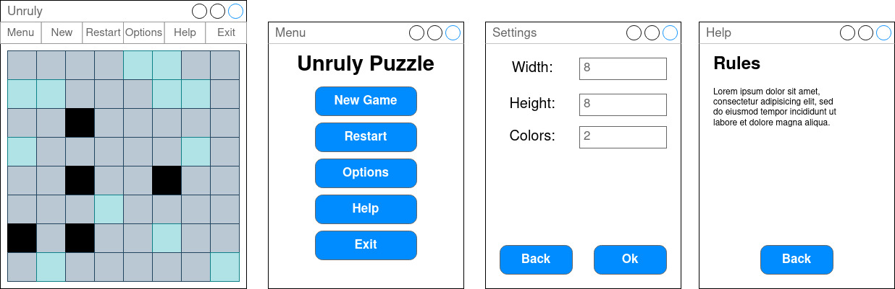

# UnrulyPuzzlePython

Реализация головоломки unruly на Python3.

## Правила

Дана сетка, состоящая из клеток, размера **N** x **M**. Пользователь может менять цвет клетки кликая на него. Каждый квадрат может принимать один из **C** цветов. Необходимо перекрасить сетку таким образом, чтобы она удовлетворяла следующим правилам:
  1. Каждая строка и столбец должны содержать одинаковое количество клеток одного цвета.
  2. В сетке не должны встречаться три или более последовательно стоящих клеток одного цвета.

## Сборка, Установка и Запуск
  1. `python3 setup.py clean --all bdist_wheel`
  2. `pip3 install dist/UnrulyPuzzlePython-0.0.1-py3-none-any.whl`
  3. `python3 -m UnrulyPuzzlePython`

## Документация
  `python3 setup.py build_sphinx`

  После выполнения команды в директории `doc/html` будет сгенерирована html
  документация.

  Кроме того, при помощи команды `python3 -m pydoc UnrulyPuzzlePython`, можно получить описание установленного
  модуля UnrulyPuzzlePython. Аналогичным образом можно
  получить описание подмодулей. Пример: `python3 -m pydoc UnrulyPuzzlePython.gui.main_menu`. 
## Тесты
  1. Для запуска тестов: `pytest`
  2. Для просмотра доступных опций: `pytest --help`
